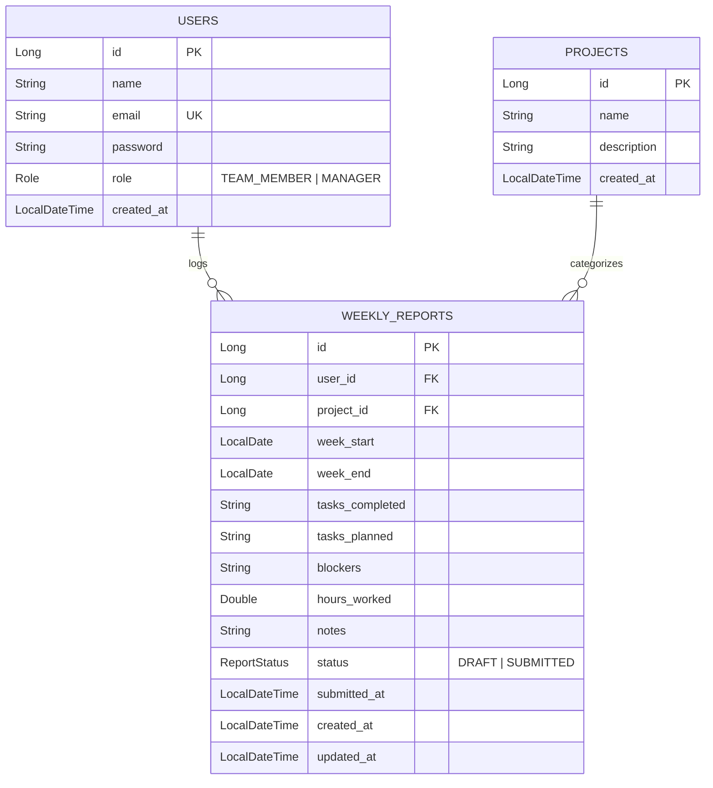

# Weekly Report Generator & Team Dashboard

A full-stack, role-based weekly report submission and manager analytics system. Built with Spring Boot (Java 21) on the backend and React + Tailwind CSS + Recharts on the frontend, featuring a conversational AI Assistant powered by Gemini 2.5 Flash.

---

## 🛠️ Technology Stack & Architecture

### Backend
- **Core:** Spring Boot 3.5.x, Java 21, Maven
- **Database:** PostgreSQL
- **Security:** Spring Security (Stateless JWT token authentication with role-based restrictions)
- **AI Integration:** Google Gemini API (`gemini-2.5-flash`) via backend HTTP integration

### Frontend
- **Core:** React 18, Vite, React Router DOM v6
- **Styling:** Tailwind CSS (Custom dark/light theme, modern card-based styling, responsive layout)
- **Charts:** Recharts (Compliance distribution, workload hours, weekly trends)
- **Icons:** Lucide React

---

## 💾 Database Entity Relationship (ER) Diagram



---

## 🚀 Setup & Execution Instructions

### Prerequisites
- Java 21 SDK
- Node.js (v18+) & npm
- PostgreSQL Database

---

### Step 1: Secret Configuration
Create a file named `.env` in the **root folder** of the project and add the following database credentials and Gemini API Key:

```env
DB_PASSWORD=YOUR_DATABASE_PASSWORD
GEMINI_API_KEY=YOUR_GEMINI_API_KEY
```
*(This file is excluded from git commits via the `.gitignore` to ensure secret security).*

---

### Step 2: Database Setup
1. Open your PostgreSQL console or client (pgAdmin / DBeaver) and create the database:
   ```sql
   CREATE DATABASE weekly_reports_db;
   ```
2. The schema will be automatically generated and updated by Hibernate on backend startup (`spring.jpa.hibernate.ddl-auto=update`).

---

### Step 3: Run the Backend Service
1. Navigate to the backend folder:
   ```bash
   cd backend
   ```
2. Compile and run the Spring Boot application using Maven:
   ```bash
   mvnw spring-boot:run
   ```
   The backend server runs on `http://localhost:8080`.

---

### Step 4: Run the Frontend App
1. Open a new terminal and navigate to the frontend folder:
   ```bash
   cd frontend
   ```
2. Install all dependencies:
   ```bash
   npm install
   ```
3. Run the development server:
   ```bash
   npm run dev
   ```
   The application runs on `http://localhost:5173`. Open your browser and navigate there.

---

## 🤖 AI Chat Assistant Details

### Approach & Prompt Design
The AI Chat Assistant is integrated directly into the backend using `RestTemplate` to call the official Gemini API (`gemini-2.5-flash`).
When a manager interacts with the assistant:
1. The backend service retrieves all submitted weekly reports for the active week.
2. It aggregates these reports into a structured text context block.
3. It builds a system prompt instructing the model to act as a Team Manager AI:
   - Must base answers *strictly* on the provided weekly reports context.
   - Must highlight blockers, workload imbalances, and completed work.
   - Must output structured markdown.
4. The request is sent to the Gemini API using the `GEMINI_API_KEY` defined in the `.env` file.

### Data Privacy & Security
- **No training data leak:** The team reports are sent as transient prompt context to the Gemini API endpoint and are not used to train the underlying model.
- **Role Restrictions:** The AI Chat Assistant API endpoint (`/api/ai/chat`) is restricted to the `MANAGER` role only. Individual team members cannot access this endpoint or view other members' data.
